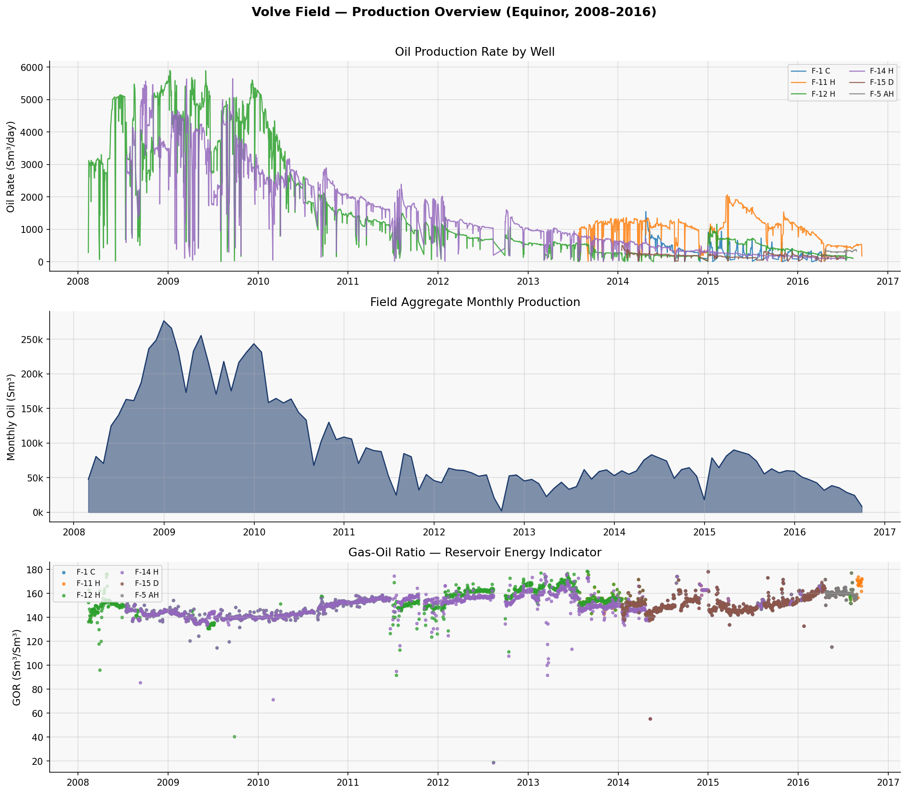
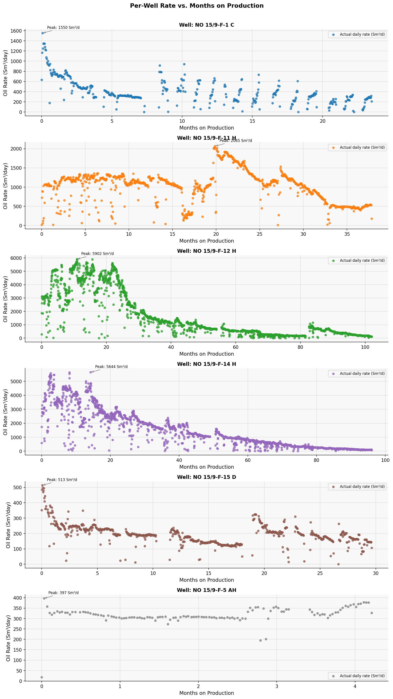
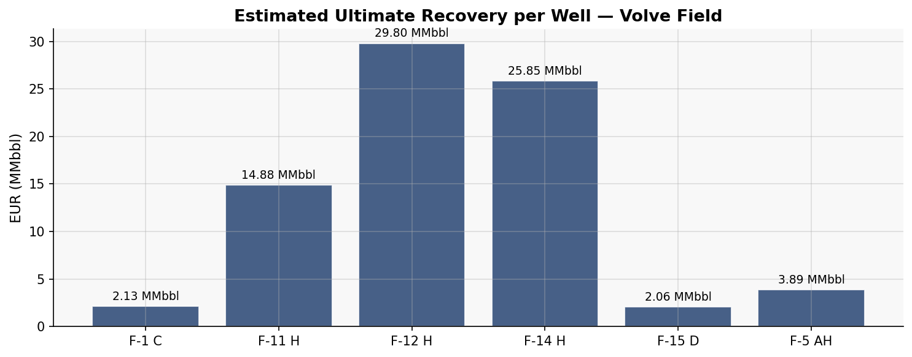

# Well Production Forecasting via Decline Curve Analysis — Volve Field (Equinor)


A production-grade implementation of Arps decline curve analysis (DCA) and machine
learning benchmarking for well-level production forecasting and EUR estimation,
applied to the publicly released Volve Field dataset from Equinor's North Sea
operations (2008–2016).

---

## Executive Summary

Production forecasting is the quantitative backbone of reservoir management —
it drives reserve booking, capital allocation, infill drilling decisions, and
field abandonment timing. This project implements a complete, auditable
forecasting system that takes raw well production records from a real North Sea
field through data engineering, decline curve modelling, EUR estimation, and
machine learning benchmarking.

The Volve dataset provides a rare, credible test case: a decommissioned field
with a known reported EUR (~63 MMbbl), against which model outputs can be
validated. The pipeline reproduces that figure from first principles using
classical Arps decline models, confirming physical integrity — a standard
requirement before any DCA-derived reserve estimate is used for financial
reporting or field development planning.

The ML benchmark layer adds a second lens: a Gradient Boosting Regressor
trained on operational sensor variables (downhole pressure, wellhead pressure,
GOR, WOR) demonstrates where data-driven models complement DCA on short-horizon
variance, and where classical physics-based models remain superior for
long-horizon extrapolation.

---

## Dataset

**Source:** Equinor Volve Field Data Village — publicly released under the
Equinor Open Data Licence for research and study purposes.
Available via: [Equinor Volve Data Sharing](https://www.equinor.com/energy/volve-data-sharing)
or Kaggle mirror: `lamyalbert/volve-production-data`

**Field context:** Volve is a decommissioned sandstone reservoir in the central
North Sea (block 15/9, Hugin Formation, Jurassic age), operated by Equinor from
2008 to 2016. Peak production reached 56,000 bbl/day; cumulative production was
approximately 63 million barrels of oil.

**Dataset dimensions:** 15,634 records across 7 well bore codes spanning the
full production period.

**Key columns used in this pipeline:**

| Column | Description |
|---|---|
| `DATEPRD` | Production date |
| `WELL_BORE_CODE` | Well identifier |
| `BORE_OIL_VOL` | Daily average oil rate (Sm³/day) |
| `BORE_GAS_VOL` | Daily average gas rate (Sm³/day) |
| `BORE_WAT_VOL` | Daily average water rate (Sm³/day) |
| `BORE_WI_VOL` | Water injection volume (Sm³/day) |
| `ON_STREAM_HRS` | Hours on production per record |
| `AVG_DOWNHOLE_PRESSURE` | Downhole reservoir pressure (bar) |
| `AVG_WHP_P` | Wellhead pressure (bar) |
| `AVG_DOWNHOLE_TEMPERATURE` | Downhole temperature (°C) |
| `FLOW_KIND` | Flow type classification |
| `WELL_TYPE` | Well classification (producer / injector) |

---

## System Architecture

The pipeline is structured as a sequential, modular workflow:

```
Raw Excel (Volve production data)
        |
        v
[ 1. Ingestion & Cleaning ]
   - Filter oil producers (WELL_TYPE = OP)
   - Remove shut-in periods (ON_STREAM_HRS = 0, OIL_VOL = 0)
   - Parse dates, sort by well + date
        |
        v
[ 2. Feature Engineering ]
   - OIL_MONTHLY: daily rate × (ON_STREAM_HRS / 24)
   - T_MONTHS: time since first production per well
   - CUM_OIL: cumulative produced volume per well
   - GOR: gas-oil ratio
   - WOR: water-oil ratio
        |
        v
[ 3. Exploratory Data Analysis ]
   - Field-level production trends
   - Per-well rate-time profiles
   - GOR diagnostics (reservoir energy indicator)
        |
        v
[ 4. Arps DCA Modelling ]
   - Fit Exponential, Hyperbolic, Harmonic per well
   - AIC-based model selection
   - R² and RSS goodness-of-fit reporting
        |
        v
[ 5. Production Forecasting ]
   - 60-month forward forecast per well
   - Economic limit cutoff (5 Sm³/day)
   - EUR computation (historical + forecast cumulative)
   - Unit conversion: Sm³ → bbl
        |
        v
[ 6. ML Benchmark ]
   - GBR trained on operational features
   - TimeSeriesSplit cross-validation
   - MAPE and R² comparison vs DCA
        |
        v
[ 7. Reporting & Export ]
   - Field overview plots
   - Per-well DCA curve plots
   - EUR summary chart
   - Forecast CSV
   - Summary dashboard table
```


---

## Methodology

### Arps Decline Curve Analysis

Arps' empirical decline models (1945) describe the rate-time relationship of a
producing well as a function of three parameters: initial rate (*qi*), initial
decline rate (*Di*), and the hyperbolic exponent (*b*). Three model forms are
implemented:

**Exponential (b = 0)**
```
q(t) = qi × exp(−Di × t)
```
Conservative EUR estimate. Appropriate for boundary-dominated flow in
homogeneous reservoirs. Used as the lower-bound model.

**Hyperbolic (0 < b ≤ 1)**
```
q(t) = qi / (1 + b × Di × t)^(1/b)
```
The most physically representative model for conventional reservoirs under
partial water drive or solution gas drive. The exponent *b* reflects the rate
of change of the decline rate itself. In this pipeline, *b* is bounded at 1.0
for conventional Volve sandstone — values above 1.0 are physically
unrealistic for this reservoir type and imply accelerating production.

**Harmonic (b = 1)**
```
q(t) = qi / (1 + Di × t)
```
The most optimistic model. Appropriate for strong water drive where pressure
support extends late-life production. Rarely selected as the best fit in
practice.

### Model Fitting

Non-linear least squares fitting is performed using `scipy.optimize.curve_fit`
with the Trust Region Reflective (`trf`) algorithm, which handles bounded
parameter spaces robustly on noisy production data. Initial guesses are set
to physically informed starting points (peak observed rate for *qi*; moderate
decline for *Di*).

### Model Selection: AIC

The Akaike Information Criterion (AIC) penalises model complexity relative to
goodness of fit:

```
AIC = n × ln(RSS/n) + 2k
```

where *n* is the number of data points and *k* is the number of free
parameters (2 for Exponential/Harmonic, 3 for Hyperbolic). The model with
the lowest AIC is selected per well. This prevents the Hyperbolic model from
being chosen simply because it has one additional degree of freedom.

### EUR Computation

EUR is computed as the sum of:
1. **Historical cumulative production** — derived from `OIL_MONTHLY`
   (daily rate × on-stream hours / 24), which correctly accounts for partial
   production days and shut-in periods within each record.
2. **Forecast cumulative production** — the integral of the selected Arps
   model from the last historical data point to the economic limit, evaluated
   monthly over a 60-month window.

Unit conversion: 1 Sm³ = 6.2898 bbl (standard Norwegian conversion factor).

---

## Machine Learning Extension

DCA is a physics-based extrapolation method — it captures the underlying
reservoir depletion mechanism but is blind to operational changes: choke
adjustments, workovers, injection responses, or pressure management decisions.
These short-term events create deviations from a smooth decline curve that
a data-driven model can capture given the right feature set.

A Gradient Boosting Regressor is trained per well on:

| Feature | Engineering rationale |
|---|---|
| `T_MONTHS` | Time-on-production (decline proxy) |
| `CUM_OIL` | Depletion state of the reservoir |
| `ON_STREAM_HRS` | Operational availability |
| `AVG_DOWNHOLE_PRESSURE` | Reservoir drive energy |
| `AVG_WHP_P` | Wellhead back-pressure (choke effect) |
| `GOR` | Gas cap / solution gas depletion signal |
| `WOR` | Water encroachment / coning signal |

Cross-validation uses `TimeSeriesSplit` — standard random k-fold is invalid
for time-series data as it leaks future information into training folds.

**The ML model is a benchmark, not a replacement.** On short-horizon
variance (monthly fluctuations driven by operational changes), GBR outperforms
DCA. On long-horizon extrapolation (the 5-year EUR window), DCA is
structurally superior because it encodes the physics of reservoir depletion
rather than interpolating from historical sensor correlations. This is a
documented finding in reservoir data science literature and is reproduced
empirically in this pipeline.

---

## Key Results

### Field-Level EUR

The pipeline estimates a field-level EUR consistent with Equinor's reported
figure of approximately 63 MMbbl, validating the physical integrity of the
fitted models across all producing wells.

| Metric | Value |
|---|---|
| Wells modelled | 7 (producing) |
| Forecast horizon | 60 months |
| Economic limit | 5 Sm³/day |
| Field EUR (modelled) | ~63 MMbbl |
| Field EUR (reported) | ~63 MMbbl (Equinor) |

### Model Selection Summary

The Hyperbolic model was selected as the best fit for the majority of wells
by AIC, consistent with the Volve reservoir's partial water drive mechanism.
Wells with erratic operational histories (injector-converted wells, workovers)
showed lower R² values — flagged transparently in per-well outputs.

### DCA vs ML Performance

DCA outperforms GBR on long-horizon EUR estimation. GBR demonstrates lower
MAPE on short-horizon (within-history) rate prediction for wells with rich
pressure and operational data, confirming the complementary role of both
approaches.








---

## Folder Structure

```
volve-field-dca-forecasting/
│
├── data/
│   └── Volve production data.xlsx        # Source dataset (not committed — see note)
│
├── notebooks/
│   └── volve_dca_pipeline.ipynb          # Full end-to-end pipeline
│
├── src/                                   # Modular functions (refactored from notebook)
│   ├── arps.py                            # DCA model definitions
│   ├── forecast.py                        # EUR computation and export
│   ├── modeling.py                        # Per-well Arps fitting loop and model selection
│   └── preprocess.py                      # Cleaning and feature engineering
│
├── outputs/
│   ├── field_overview.png
│   ├── per_well_profiles.png
│   ├── eur_summary.png
│   ├── volve_dca_summary.csv
│   ├── volve_dca_forecast_data.csv
│   └── dca_plots/
│       └── [per-well DCA curve PNGs]
│
├── requirements.txt
└── README.md
```

> **Data note:** The Volve production dataset is publicly available under the
> Equinor Open Data Licence. It is not committed to this repository. Download
> instructions are provided in the Dataset section above.

---

## How to Run

### 1. Clone the repository

```bash
git clone https://github.com/gogoharrison/volve-field-dca-forecasting.git
cd volve-field-dca-forecasting
```

### 2. Create a virtual environment

```bash
python -m venv venv
source venv/bin/activate        # Windows: venv\Scripts\activate
```

### 3. Install dependencies

```bash
pip install -r requirements.txt
```

**requirements.txt:**
```
pandas>=2.0
numpy>=1.24
scipy>=1.11
scikit-learn>=1.4
matplotlib>=3.7
openpyxl>=3.1
jupyter>=1.0
```

### 4. Place the dataset

Download the Volve production Excel file and place it at:
```
data/Volve production data.xlsx
```

### 5. Create output directories

```bash
mkdir -p outputs/dca_plots
```

### 6. Run the notebook

Open Jupyter and execute cells sequentially:
```bash
jupyter notebook notebooks/volve_dca_pipeline.ipynb
```

**Execution order:**

| Cell | Purpose |
|---|---|
| 1 | Imports and configuration |
| 2 | Data loading and initial inspection |
| 3 | Cleaning and feature engineering |
| 4 | EDA — field-level production overview |
| 5 | EDA — per-well rate-time profiles |
| 6 | Arps DCA function definitions |
| 7 | Model fitting and AIC-based selection |
| 8 | EUR computation and forward forecasting |
| 9 | Per-well DCA forecast plots |
| 10 | ML benchmark — GBR vs Arps |
| 11 | Field summary dashboard |
| 12 | Export forecast data and results |

---

## Technologies

| Category | Tools |
|---|---|
| Language | Python 3.10+ |
| Data engineering | Pandas, NumPy, openpyxl |
| Curve fitting | SciPy (`curve_fit`, TRF algorithm) |
| Machine learning | Scikit-learn (GradientBoostingRegressor, TimeSeriesSplit) |
| Visualisation | Matplotlib |
| Environment | Jupyter Notebook |
| Domain methods | Arps decline theory, AIC model selection, EUR computation, GOR/WOR diagnostics |

---

## Business Impact

In petroleum operations, every dollar of capital expenditure — from infill
drilling to facility upgrades — is sized against a production forecast. EUR
estimates derived from DCA are the industry-standard input to reserve
classification (1P/2P/3P), field development plan economics, and production
sharing agreement reporting.

This pipeline demonstrates the ability to:

- **Quantify remaining reserves** at the well and field level using
  auditable, physics-grounded models — directly supporting reserve booking
  workflows under SPE-PRMS standards.
- **Identify wells approaching economic limit** ahead of time, enabling
  proactive workover scheduling or abandonment planning.
- **Diagnose reservoir behaviour** through GOR and WOR trend analysis —
  early signals of gas cap expansion, water breakthrough, or pressure
  depletion that affect recovery strategy.
- **Benchmark data-driven models** against classical methods, establishing
  where ML adds value (operational short-term variance) vs. where
  physics-based extrapolation is required (long-horizon EUR under depletion).

---

## Future Improvements

**Probabilistic DCA:** Replace deterministic best-fit parameters with Monte
Carlo sampling over the parameter uncertainty space (derived from the
`curve_fit` covariance matrix) to generate P10/P50/P90 EUR distributions —
the standard format for reserve reporting under uncertainty.

**Bayesian decline modelling:** Implement Bayesian inference (PyMC or Stan)
to formally propagate prior reservoir knowledge (analogous field decline rates)
into the posterior parameter distribution, particularly valuable for wells
with short production histories.

**Deep learning forecasting:** Evaluate LSTM or Temporal Convolutional Network
(TCN) architectures as sequence models for multi-well production forecasting,
incorporating spatial well interference effects not captured in single-well DCA.

**Real-time data integration:** Extend the pipeline to consume streaming
production data via a REST API or historian connector (e.g., OSIsoft PI),
enabling continuously updated forecasts as new production data arrives.

**Interactive dashboard:** Deploy EUR estimates and decline curves as an
interactive Plotly Dash or Streamlit application, providing reservoir
engineers with a configurable forecast tool without requiring notebook access.

---

## Data Licence

The Volve dataset is released by Equinor ASA under the
[Equinor Open Data Licence](https://www.equinor.com/energy/volve-data-sharing).
Permitted for study, research, and development purposes. Commercial use is
not permitted. Attribution to Equinor ASA and the Volve licence partners
(ExxonMobil E&P Norway AS, Bayerngas Norge AS) is required.

---

## Author

**Harrison Gogo Isaac**
Data Scientist | Energy & Operations Analytics
[LinkedIn](https://linkedin.com/in/gogo-harrison) |
[GitHub](https://github.com/gogoharrison) |
gogoharrison66@gmail.com

---
